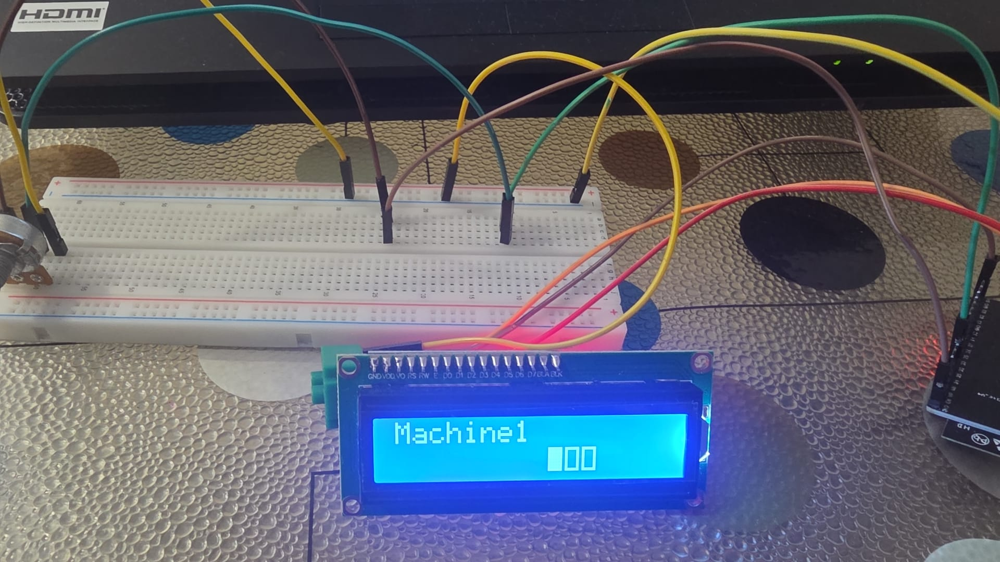
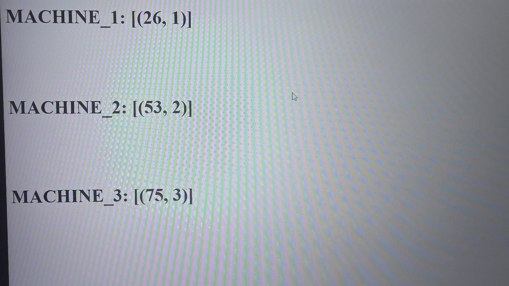
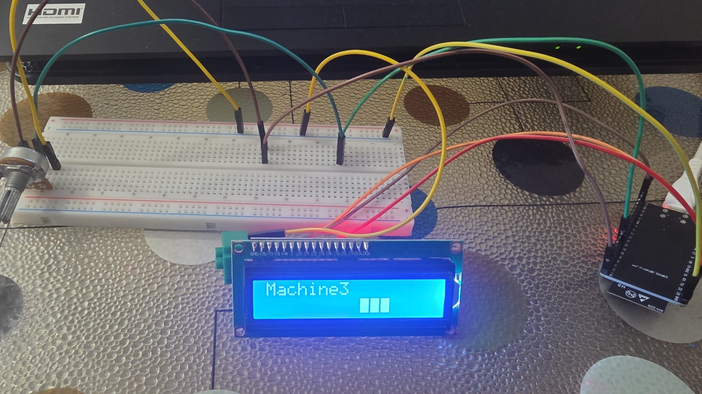
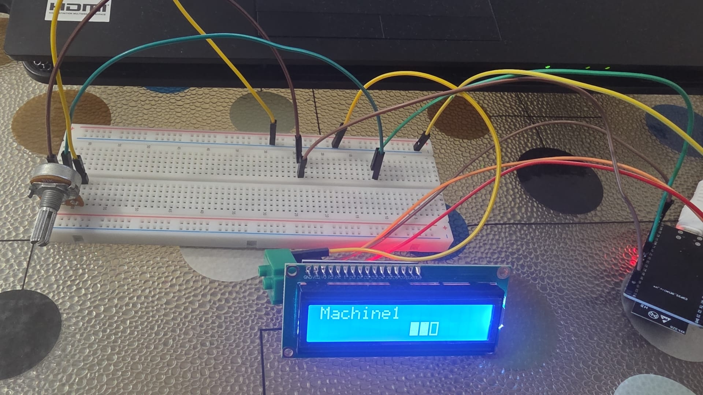

# ESP32 & FastAPI Industrial Telemetry (Digital Twin Approach)

<p align="center">
  
  
  
  
  
</p>

This project is an end-to-end IoT telemetry system that collects or simulates temperature data from three different industrial machines via an ESP32 and transmits this data to a FastAPI-based server. The project focuses on memory (RAM) optimization and utilizes a "URL-encoded" communication protocol—which entails a lower data payload—instead of standard JSON.

By implementing a "Digital Twin" logic on the database side, the instantaneous states (temperature and fan level) of just three machines were tracked using UPDATE commands, rather than bloating the database with logs.

🚀 Key Features (Engineering Highlights)
Low-Overhead HTTP Communication: To keep the ESP32's RAM usage to a minimum, data is sent in the application/x-www-form-urlencoded format (e.g., temp=45&machine_id=1) instead of JSON. The server response is returned as PlainText to eliminate parsing overhead on the client side.

Single Connection (Stateless) Architecture: The ESP32 sends a POST request to write data to the server and receives the calculated fan speed in the response of that same request. There is no need for a secondary GET request.

Digital Twin Database: A single table (machines) created on SQLite stores the real-time status of the 3 machines. The database is automatically seeded at system startup.

Custom LCD HMI (Human-Machine Interface): By creating custom characters on a 16x2 I2C LCD screen, the fan speed levels (1, 2, and 3) returned from the server are converted into a dynamic bar graph ([■][■][ ]).

⚙️ System Logic
The system sequentially reports the temperature values of the 3 machines to the server every 3 seconds:

Machine 1 (Physical): Potentiometer data read via the ADC pin (Pin 33), mapped between 20°C and 96°C.

Machine 2 (Virtual): Simulated temperature randomly generated between 45°C and 70°C.

Machine 3 (Virtual): Simulated temperature randomly generated between 70°C and 96°C.

Server-Side Fan Rules (FastAPI):

T < 45°C ➔ Fan Level: 1

T < 70°C ➔ Fan Level: 2

T ≥ 70°C ➔ Fan Level: 3

📂 File Structure
```text
esp32-fastapi-telemetry/
│
├── esp32_iot_client.ino      # ESP32 C++ source code (Sensor reading and HTTP POST)
├── fastapi_iot_server.py     # Python FastAPI backend and SQLite database management
├── dashboard.html            # Jinja2 interface displaying real-time machine statuses
└── README.md                 # Project documentation
