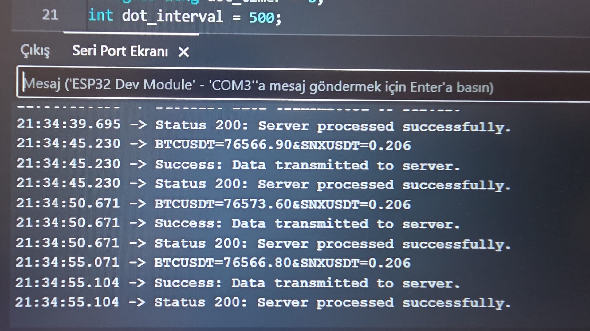

# ESP32 Wireless Binance & Altcoin Tracker

<p align="center">
  
</p>

An advanced IoT asset tracking project that fetches real-time cryptocurrency ticker prices (BTC and SNX) directly from the Binance Futures public API using an ESP32. The edge device processes the price payloads and transmits them via HTTP POST requests to a local FastAPI backend, which permanently logs the financial data into an SQLite database for tracking and analysis.

> **Project Evolution & Scale-Up:** 
> This system elevates the previous local telemetry projects by connecting an embedded microcontroller directly to external internet APIs (Binance REST API) over Wi-Fi, bridging real-world financial data feeds with a local Python server architecture.

## System Architecture

*   **Edge Device (ESP32):** Connects to the local network, makes periodic HTTP GET requests to external Binance endpoints every 5 seconds, parses the ticker data, and forwards it via HTTP POST (`application/x-www-form-urlencoded`).
*   **Backend Server (FastAPI):** An asynchronous Python server that handles incoming POST requests, extracts the cryptocurrency values, and logs them into a structured SQLite database with automatic timestamps.

## Software Stack
*   **C++ / Arduino IDE:** `WiFi.h`, `HTTPClient.h`
*   **Python 3:** `fastapi`, `uvicorn`, `sqlite3`

## Installation & Usage

### 1. Backend Setup (PC)
1. Navigate to the `fastapi_server` directory.
2. Install the required server dependencies: 
   ```bash
   pip install fastapi uvicorn
