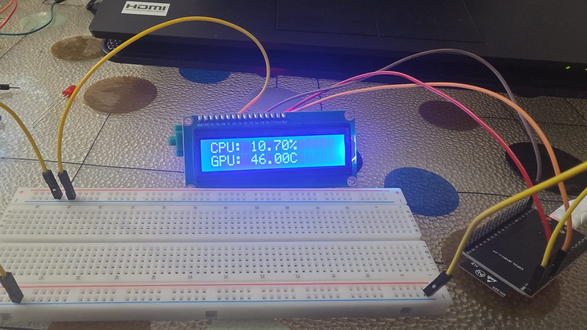
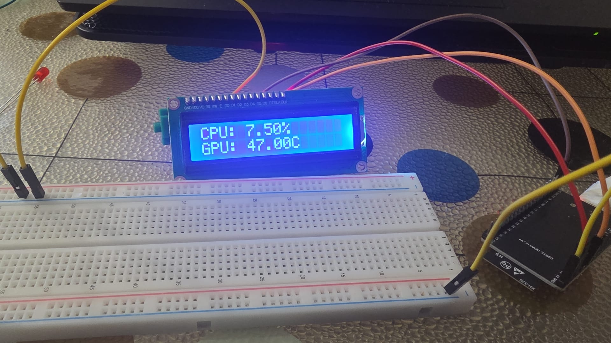

# ESP32 Wireless PC Hardware Telemetry

<p align="center">
  
  
</p>

A real-time IoT monitoring system that streams PC hardware metrics (CPU utilization and GPU temperature) over a local Wi-Fi network. An ESP32 acts as an edge node, making periodic HTTP GET requests to a Python web server, parsing the incoming JSON payload, and displaying the live data on an I2C LCD screen.

> **Project Evolution & Scale-Up:** 
> This system is the wireless IoT evolution of a previous Arduino-based serial telemetry project. By replacing the physical UART cable with a Wi-Fi-enabled ESP32 and upgrading the backend to a FastAPI REST architecture, this project demonstrates a significant leap in system design, data parsing (JSON), and wireless local area network (WLAN) communication.

## System Architecture

*   **Edge Device (ESP32):** Connects to the local network, sends periodic HTTP GET requests every 5 seconds, parses the JSON response using `ArduinoJson`, and drives a 16x2 I2C LCD.
*   **Backend Server (FastAPI):** A Python-based server that reads low-level hardware metrics using `psutil` and `GPUtil`, serves the data via an API endpoint, and logs the historical telemetry into an SQLite database for auditing.

## Hardware Configuration

| Component | ESP32 GPIO | Description |
| :--- | :--- | :--- |
| **16x2 LCD (I2C)** | SDA (21) / SCL (22) | Displays real-time CPU% and GPU°C |
| **ESP32 NodeMCU** | - | Handles Wi-Fi connection and HTTP requests |

## Software Stack
*   **C++ / Arduino IDE:** `WiFi.h`, `HTTPClient.h`, `ArduinoJson.h`, `LiquidCrystal_I2C.h`
*   **Python 3:** `fastapi`, `uvicorn`, `sqlite3`, `psutil`, `GPUtil`

## Installation & Usage

### 1. Backend Setup (PC)
1. Navigate to the `fastapi_server` directory.
2. Install the required hardware monitoring and server libraries: 
   ```bash
   pip install fastapi uvicorn psutil GPUtil
